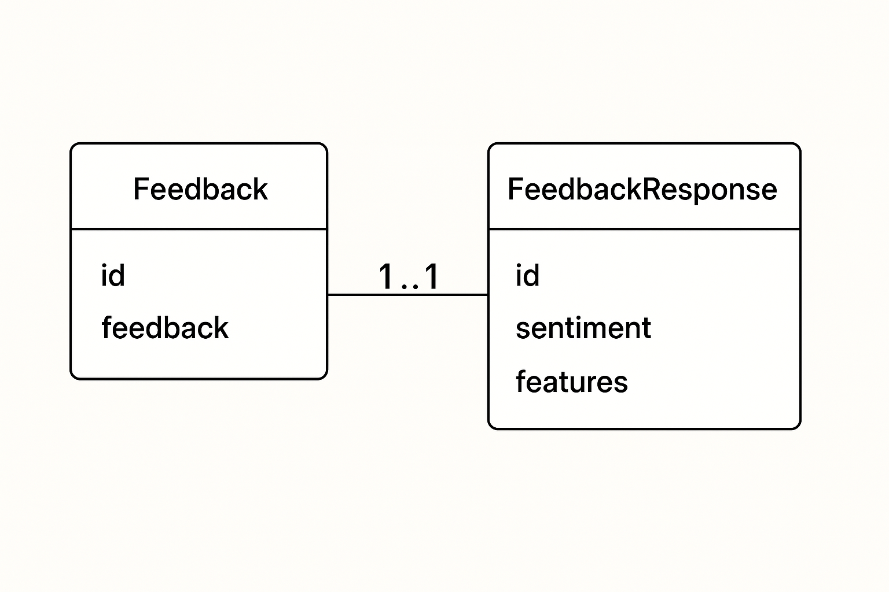
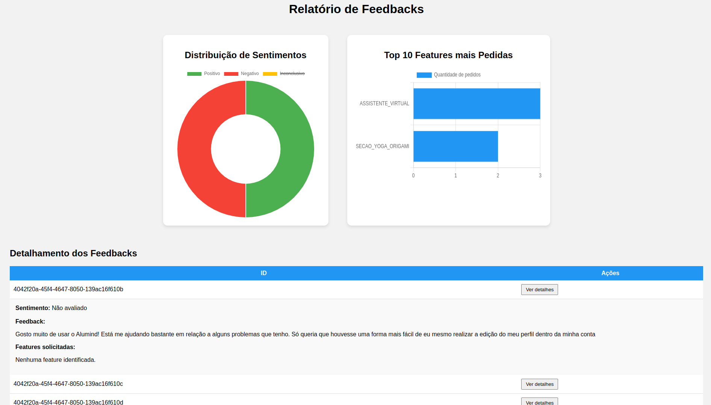

# 🌟 Alumind - Análise de Feedbacks para Bem-Estar e Saúde Mental 🌟

A **AluMind** é uma startup que oferece um aplicativo focado em bem-estar e saúde mental, proporcionando aos usuários acesso a meditações guiadas, sessões de terapia, e conteúdos educativos sobre saúde mental. Com o alto crescimento da base de usuários, a **AluMind** está começando a ter gargalos para analisar feedbacks vindo dos usuários em diferentes plataformas (canais de atendimento ao cliente; comunidades no Discord; redes sociais).

---

## 🚀 Como Executar a Aplicação

Antes de rodar a aplicação, você precisa garantir que os seguintes requisitos estejam instalados:

1. **Python 3.10**
2. **MySQL**

### 🌱 Ambiente Virtual (Recomendado)
Recomendamos o uso de um ambiente virtual (python-venv) para manter as dependências isoladas. Para isso, instale o `venv` com o seguinte comando:
```bash
pip install venv
```

### 🔧 Passos para Configuração:

1. Crie e ative seu ambiente virtual:
   ```bash
   python -m venv venv
   source venv/bin/activate  # Para Linux/MacOS
   .\venv\Scripts\activate   # Para Windows
   ```

2. Instale as dependências dentro da pasta `src`:
   ```bash
   pip install -r requirements.txt
   ```

3. Crie o arquivo **.env** fora da pasta `src`, contendo as variáveis a seguir:

```env
OPENAI_API_KEY=  # Chave da OpenAI com créditos suficientes
USER_EMAIL=      # Conta Google válida
USER_PASSWORD=   # Senha de aplicação Google (Configuração: https://support.google.com/accounts/answer/185833?hl=en)
MYSQL_USER='alumind_user'     # Usuário MySQL (padrão: alumind_user)
MYSQL_PASSWORD=  # Senha MySQL
MYSQL_DB='alumind'       # Nome do banco de dados (padrão: alumind)
```

Crie um usuário alumind_user no seu banco de dados MySQL e dê passe as credenciais dele para as variáveis de ambiente
MYSQL_USER e MY_SQLPASSWORD. Alternativamente, você pode utilizar o usuário root.

4. Com as variáveis de ambiente definidas, execute o comando para iniciar o servidor Flask:
   ```bash
   flask --app app run
   ```

A aplicação estará disponível no endereço padrão do flask caso não tenha nenhum outro serviço utilizando as portas padrão, elas costumam ser:
- **Ubuntu**: http://127.0.0.1:5000
- **Windows**: http://localhost:8080

---

## 🖼️ Como Funciona a Aplicação

A aplicação tem duas entidades básicas: Feedbacks, que são enviados pelo sistema e coletados a partir dos usuários, e FeedbackResponses, que são objetos criados a partir da avaliação e classificação de uma LLM.

* Não achei necessário criar uma entidade separada para features porque no banco de dados dava para salvar uma lista de objetos no atributo 'features', então acabei deixando apenas como atributo de FeedbackResponse.


A aplicação aceita dois tipos de requisições:

1. **POST** para `/features`:
   - Envia um **JSON** com o feedback do usuário para análise.
   
2. **GET** para o endpoint base:
   - Exibe um **relatório** contendo dois gráficos interativos:
     - **Gráfico de Sentimentos**: Exibe a porcentagem de feedbacks classificados como **POSITIVO**, **NEGATIVO** ou **INCONCLUSIVO**.
     - **Gráfico de Funcionalidades**: Apresenta as **10 funcionalidades mais solicitadas** pelos usuários.
   - Abaixo dos gráficos, há uma tabela detalhada com informações de cada feedback.

**Exemplo de funcionamento do relatório**:


---

## 🛠️ Desenvolvimento e Arquitetura

### Arquitetura Utilizada

A aplicação foi desenvolvida utilizando a arquitetura **Model-View-Controller (MVC)**, visando a separação clara das responsabilidades:

- **Model**: Contém os modelos de dados que estruturam as entidades do sistema.
- **View**: Responsável pela visualização dos dados (relatório gerado com gráficos interativos).
- **Controller**: Gerencia as interações com o usuário, processamento de dados e serviços.

### Funcionalidades Implementadas

Durante o desenvolvimento, dividi as funcionalidades em **obrigatórias** e **desejáveis**, o que me permitiu criar um plano de implementação eficiente. Alguns dos requisitos não estavam descritos claramente, então tive de tomar algumas decisões de implementação:

- **Horário do envio de e-mails para stakeholders**: A aplicação está configurada para enviar e-mails toda sexta-feira às 17h. Isso pode ser facilmente ajustado alterando a string de hora no controlador.
- **Gráficos**: Utilizei o **Chart.js** para criar dois gráficos interativos:
  - **Gráfico de Sentimentos**: Um gráfico de rosquinha que exibe a quantidade de feedbacks divididos nas categorias **POSITIVO**, **NEGATIVO** e **INCONCLUSIVO**.
  - **Gráfico de Funcionalidades**: Apresenta as 10 funcionalidades mais solicitadas pelos usuários. Como essas funcionalidades podem exigir tempo para implementação, o gráfico destaca apenas as 10 mais requisitadas.

Além disso, o **Chart.js** foi utilizado para garantir a interatividade dos gráficos – você pode clicar em diferentes partes deles para explorar mais dados!

---

## 📈 Conclusão

Esta aplicação é uma solução robusta e simples para analisar o feedback dos usuários e gerar insights para a **AluMind**. Com uma estrutura clara e ferramentas interativas, ela oferece uma visão rápida e detalhada sobre os sentimentos dos usuários e as melhorias mais solicitadas.
